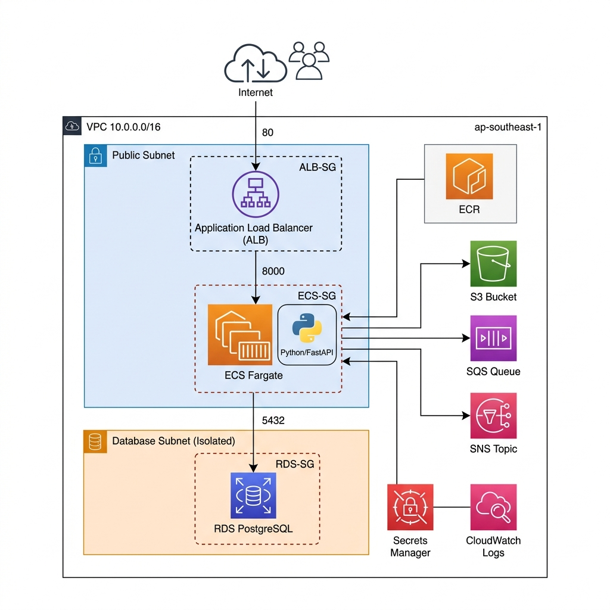

# Architecture

## Overview

This project deploys a containerized Python web application on AWS using a classic **3-tier architecture**:

1. **Presentation Tier** — Application Load Balancer (ALB) receives HTTP traffic from the internet
2. **Application Tier** — ECS Fargate containers run the FastAPI app in public subnets
3. **Data Tier** — RDS PostgreSQL runs in isolated database subnets (no internet access)

Additionally, **event-driven services** (S3, SQS, SNS) are used for object storage, message queuing, and pub/sub notifications.

---

## Architecture Diagram



```
                        ┌──────────────┐
                        │   Internet   │
                        └──────┬───────┘
                               │
                        ┌──────▼───────┐
                        │  ALB (HTTP)  │  ← Public, port 80
                        │  alb-sg      │
                        └──────┬───────┘
                               │ (only port 8000 allowed)
                ┌──────────────▼──────────────┐
                │     ECS Fargate Tasks       │  ← Public subnets
                │     ecs-sg                  │     (assign_public_ip = true)
                │  ┌────────────────────┐     │
                │  │  FastAPI Container │     │
                │  │  - /health         │     │
                │  │  - /db/*           │──────────┐
                │  │  - /s3/*           │──┐  │    │
                │  │  - /sqs/*          │──┼──┼────┼──┐
                │  │  - /sns/*          │──┼──┼────┼──┼──┐
                │  └────────────────────┘  │  │    │  │  │
                └──────────────────────────┼──┘    │  │  │
                                           │       │  │  │
           ┌───────────────────────────────┘       │  │  │
           │            ┌──────────────────────────┘  │  │
           │            │            ┌────────────────┘  │
           │            │            │          ┌────────┘
           ▼            ▼            ▼          ▼
      ┌─────────┐ ┌──────────┐ ┌─────────┐ ┌─────────┐
      │   S3    │ │   RDS    │ │   SQS   │ │   SNS   │
      │ Bucket  │ │ Postgres │ │  Queue  │ │  Topic  │
      └─────────┘ └──────────┘ └─────────┘ └─────────┘
                   (db subnets,
                    rds-sg,
                    no public IP)
```

---

## AWS Services Used

### Phase 1: Network & Security

| Service | Resource | Purpose |
|---|---|---|
| **VPC** | `aws_vpc` | Isolated virtual network (`10.0.0.0/16`) |
| **Subnets** | `aws_subnet` (public ×2) | Host ALB and ECS tasks in 2 AZs |
| | `aws_subnet` (database ×2) | Host RDS in isolated subnets (no internet) |
| **Internet Gateway** | `aws_internet_gateway` | Provides internet access to public subnets |
| **Route Tables** | `aws_route_table` (public) | Routes `0.0.0.0/0` → IGW |
| | `aws_route_table` (database) | No internet route (isolated) |
| **Security Groups** | `alb-sg` | Inbound: HTTP/HTTPS from `0.0.0.0/0` |
| | `ecs-sg` | Inbound: port 8000 from ALB-SG only |
| | `rds-sg` | Inbound: port 5432 from ECS-SG only |

### Phase 2: Data Tier

| Service | Resource | Purpose |
|---|---|---|
| **RDS** | `aws_db_instance` (PostgreSQL 16) | Managed relational database |
| **Secrets Manager** | `aws_secretsmanager_secret` | Stores DB credentials (username, password, host, port, dbname) |

### Phase 3: Event-Driven Integrations

| Service | Resource | Purpose |
|---|---|---|
| **S3** | `aws_s3_bucket` | Object storage (file uploads) |
| | `aws_s3_bucket_public_access_block` | Blocks all public access |
| **SQS** | `aws_sqs_queue` | Message queue (decouple producers/consumers) |
| **SNS** | `aws_sns_topic` | Pub/sub notifications (broadcast messages) |

### Phase 4: Compute & Application

| Service | Resource | Purpose |
|---|---|---|
| **ECR** | `aws_ecr_repository` | Private Docker image registry |
| **ECS** | `aws_ecs_cluster` | Logical grouping for services |
| | `aws_ecs_task_definition` | Container config (image, CPU, memory, env, secrets) |
| | `aws_ecs_service` | Runs 1 Fargate task, registered with ALB |
| **ALB** | `aws_lb` | Internet-facing load balancer |
| | `aws_lb_target_group` | Health-checked target group (IP type) |
| | `aws_lb_listener` | HTTP:80 → forward to target group |
| **IAM** | Task Execution Role | Pull images, write logs, read secrets |
| | Task Role | App-level access to S3, SQS, SNS |
| **CloudWatch Logs** | `aws_cloudwatch_log_group` | Container stdout/stderr (7-day retention) |

---

## Network Topology

### VPC CIDR: `10.0.0.0/16`

| Subnet | CIDR | AZ | Tier | Internet Access |
|---|---|---|---|---|
| `public-1` | `10.0.1.0/24` | ap-southeast-1a | Public | ✅ via IGW |
| `public-2` | `10.0.2.0/24` | ap-southeast-1b | Public | ✅ via IGW |
| `db-1` | `10.0.101.0/24` | ap-southeast-1a | Database | ❌ Isolated |
| `db-2` | `10.0.102.0/24` | ap-southeast-1b | Database | ❌ Isolated |

### Security Group Chain

Traffic flows through a strict chain. Each layer can **only** be reached from the previous one:

```
Internet → ALB-SG (port 80/443) → ECS-SG (port 8000) → RDS-SG (port 5432)
```

- **ALB-SG**: Accepts HTTP (80) and HTTPS (443) from `0.0.0.0/0`
- **ECS-SG**: Accepts port 8000 **only** from ALB-SG (security group reference)
- **RDS-SG**: Accepts port 5432 **only** from ECS-SG (security group reference)

This means the database is **never** directly accessible from the internet. It can only be reached through the application container, which itself can only be reached through the load balancer.

---

## Data Flow

### HTTP Request Flow

```
User → ALB (port 80) → ECS Container (port 8000) → FastAPI Router → AWS Service
```

### Secret Injection Flow

```
Terraform creates secret in Secrets Manager
    ↓
ECS Task Definition references secret ARN in `secrets` block
    ↓
ECS Agent (Execution Role) fetches secret value at task launch
    ↓
Secret JSON string is injected as env var DB_SECRET_ARN
    ↓
App parses JSON string directly (no Boto3 call needed)
```

### Container Deployment Flow

```
deploy.sh:
  1. terraform apply         → Provisions/updates infrastructure
  2. aws ecr get-login       → Authenticates Docker with ECR
  3. docker build & push     → Builds image, pushes to ECR
  4. aws ecs update-service  → Forces ECS to pull latest image
```
